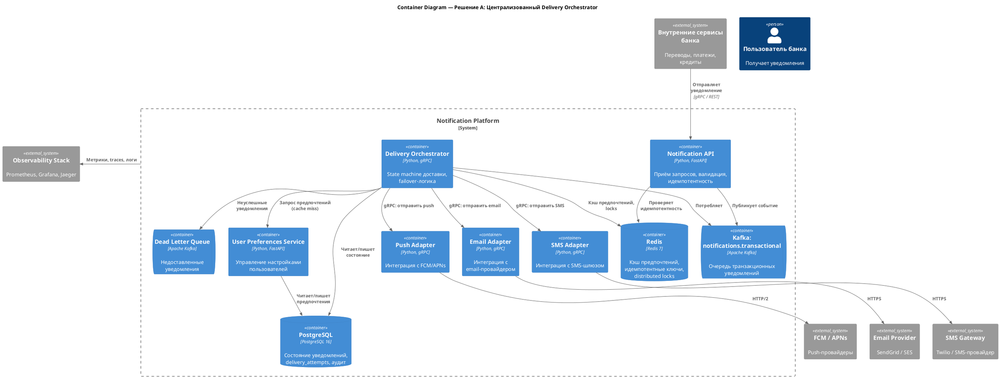
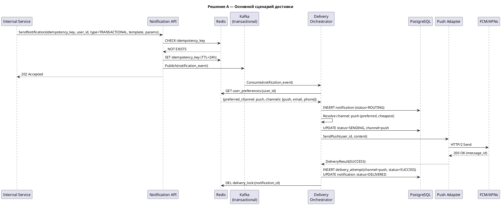
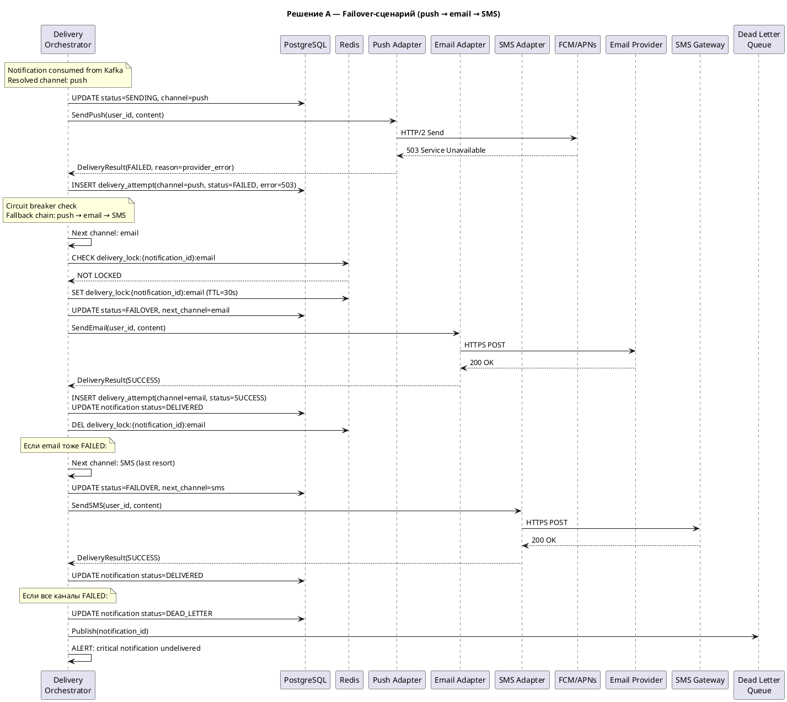
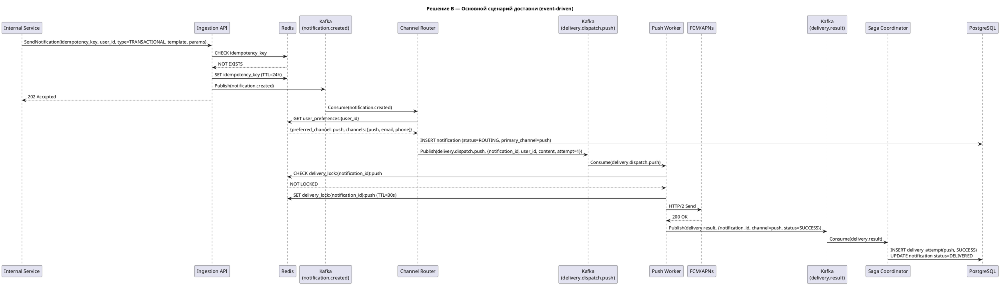
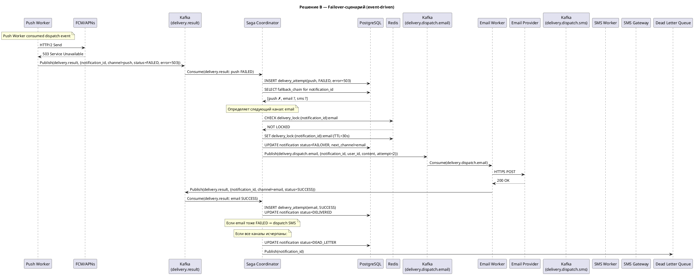

```plantuml
@startuml
!include <C4/C4_Container>

title Container Diagram — Решение B: Event-Driven Pipeline с Saga Coordinator

Person(user, "Пользователь банка", "Получает уведомления")
System_Ext(internal_svc, "Внутренние сервисы банка", "Переводы, платежи, кредиты")

System_Boundary(np, "Notification Platform") {
    Container(api, "Notification Ingestion API", "Python, FastAPI", "Приём, валидация, обогащение, публикация")
    ContainerQueue(kafka_created, "Kafka: notification.created", "Apache Kafka", "Новые уведомления")
    Container(router, "Channel Router", "Python", "Разрешение канала на основе предпочтений, стоимости, доступности")
    ContainerQueue(kafka_push, "Kafka: delivery.dispatch.push", "Apache Kafka", "Задания на push-доставку")
    ContainerQueue(kafka_email, "Kafka: delivery.dispatch.email", "Apache Kafka", "Задания на email-доставку")
    ContainerQueue(kafka_sms, "Kafka: delivery.dispatch.sms", "Apache Kafka", "Задания на SMS-доставку")
    ContainerQueue(kafka_result, "Kafka: delivery.result", "Apache Kafka", "Результаты доставки")
    Container(push_worker, "Push Worker", "Python", "Consumer: отправка push, публикация результата")
    Container(email_worker, "Email Worker", "Python", "Consumer: отправка email, публикация результата")
    Container(sms_worker, "SMS Worker", "Python", "Consumer: отправка SMS, публикация результата")
    Container(saga, "Saga Coordinator", "Python", "Слушает delivery.result, управляет failover, публикует retry-события")
    ContainerDb(postgres, "PostgreSQL", "PostgreSQL 16", "Event log, состояние доставки")
    ContainerDb(redis, "Redis", "Redis 7", "Кэш предпочтений, идемпотентность, locks")
    ContainerQueue(dlq, "Dead Letter Queue", "Apache Kafka", "Исчерпанные попытки")
}

System_Ext(fcm, "FCM / APNs", "Push-провайдеры")
System_Ext(email_provider, "Email Provider", "Amazon SES")
System_Ext(sms_provider, "SMS Gateway", "Twilio")
System_Ext(monitoring, "Observability Stack", "Prometheus, Grafana, Jaeger")

Rel(internal_svc, api, "gRPC / REST")
Rel(api, redis, "Идемпотентность")
Rel(api, kafka_created, "Publish")
Rel(router, kafka_created, "Consume")
Rel(router, redis, "Кэш предпочтений")
Rel(router, kafka_push, "Dispatch push")
Rel(router, kafka_email, "Dispatch email")
Rel(router, kafka_sms, "Dispatch SMS")
Rel(push_worker, kafka_push, "Consume")
Rel(email_worker, kafka_email, "Consume")
Rel(sms_worker, kafka_sms, "Consume")
Rel(push_worker, fcm, "HTTP/2")
Rel(email_worker, email_provider, "HTTPS")
Rel(sms_worker, sms_provider, "HTTPS")
Rel(push_worker, kafka_result, "Publish result")
Rel(email_worker, kafka_result, "Publish result")
Rel(sms_worker, kafka_result, "Publish result")
Rel(saga, kafka_result, "Consume results")
Rel(saga, kafka_push, "Failover: dispatch to push")
Rel(saga, kafka_email, "Failover: dispatch to email")
Rel(saga, kafka_sms, "Failover: dispatch to SMS")
Rel(saga, postgres, "Читает/пишет состояние")
Rel(saga, redis, "Locks, дедупликация")
Rel(saga, dlq, "Неуспешные уведомления")
Rel(router, postgres, "Пишет начальное состояние")
Rel_L(np, monitoring, "Метрики, traces, логи")

@enduml
```

# Домашнее задание №4 — Требования и архитектурное мышление
## Централизованная платформа уведомлений (Notification Platform)

---

## 1. Функциональные требования

### FR-1: Единый API для отправки уведомлений
**User Story:** Как разработчик внутреннего сервиса, я хочу отправлять уведомления через единый API, чтобы не реализовывать логику доставки самостоятельно.

Система предоставляет унифицированный API (REST/gRPC), через который все внутренние сервисы отправляют уведомления. API принимает тип уведомления, получателя, шаблон и параметры. Вызывающий сервис не управляет каналом доставки — это решает платформа.

**Связь с бизнес-целями:** снижение жалоб на уведомления за счёт единообразного поведения; устранение дублирования из-за разрозненных систем.

### FR-2: Гарантированная доставка транзакционных уведомлений
**User Story:** Как пользователь банка, я хочу мгновенно получать уведомления о списаниях и переводах, чтобы контролировать свои финансы.

Транзакционные уведомления (подтверждение перевода, списание средств, вход в аккаунт) должны быть доставлены хотя бы через один канал. При сбое основного канала система автоматически переключается на резервный.

**Связь с бизнес-целями:** гарантированная доставка критичных сообщений; повышение retention за счёт доверия.

### FR-3: Управление пользовательскими предпочтениями
**User Story:** Как пользователь, я хочу выбирать каналы и типы уведомлений, чтобы не получать лишние сообщения.

Пользователь может:
- Выбирать предпочтительный канал доставки (push / SMS / email)
- Отключать **маркетинговые** уведомления
- Отключать **сервисные** уведомления (кроме юридически обязательных)
- **Транзакционные** уведомления отключить **нельзя** (требование регулятора и безопасности)

**Связь с бизнес-целями:** снижение жалоб на 30%; соответствие ФЗ о рекламе.

### FR-4: Дедупликация уведомлений
**User Story:** Как пользователь, я не хочу получать одно и то же уведомление дважды.

Система обеспечивает идемпотентность доставки: при повторной отправке запроса с тем же идемпотентным ключом повторного уведомления не происходит. При failover на другой канал предыдущая попытка не дублируется.

**Связь с бизнес-целями:** снижение жалоб; повышение качества UX.

### FR-5: Массовые маркетинговые рассылки
**User Story:** Как маркетолог, я хочу отправлять акционные уведомления до 1 млн пользователей, не влияя на доставку критичных сообщений.

Система поддерживает массовые кампании с rate limiting и приоритизацией. Маркетинговые рассылки обрабатываются с более низким приоритетом и не блокируют транзакционные уведомления.

**Связь с бизнес-целями:** увеличение retention на 15% за счёт вовлечения; защита критичного потока.

### FR-6: Отслеживание статуса доставки
**User Story:** Как оператор платформы, я хочу видеть статус каждого уведомления (отправлено, доставлено, ошибка, failover), чтобы выявлять и решать проблемы.

Система ведёт полный лог жизненного цикла каждого уведомления: создание → маршрутизация → попытка доставки → подтверждение / ошибка → failover → итоговый статус.

**Связь с бизнес-целями:** централизованный контроль; сокращение времени реагирования на инциденты.

### FR-7: Шаблонизация уведомлений
**User Story:** Как продакт-менеджер, я хочу управлять текстами уведомлений через шаблоны, не привлекая разработчиков для каждого изменения.

Система поддерживает шаблоны уведомлений с подстановкой параметров. Шаблоны хранятся централизованно и версионируются.

**Связь с бизнес-целями:** ускорение запуска кампаний; единообразие коммуникации.

---

## 2. Нефункциональные требования

### NFR-1: Задержка доставки (Latency)
- **Транзакционные:** p99 ≤ **2 секунды** от получения запроса до отправки провайдеру
- **Сервисные:** p99 ≤ **30 секунд**
- **Маркетинговые:** ≤ **5 минут** для одного сообщения в рамках кампании

### NFR-2: Пропускная способность (Throughput)
- Среднее: **30 млн уведомлений/день** (~350 RPS)
- Пиковое: **2 000 RPS** (пиковые часы, утренние операции)
- Маркетинговые burst: дополнительно **до 300 RPS** при кампании на 1 млн за 1 час

### NFR-3: Доступность (Availability)
- **99.95%** uptime (≤ 22 минуты простоя в месяц)
- Для транзакционного потока: **99.99%** (≤ 4.3 минуты/месяц)

### NFR-4: Надёжность доставки (Reliability)
- Транзакционные уведомления: **≥ 99.9%** success rate с учётом failover
- Сервисные: **≥ 99.5%**
- Маркетинговые: **≥ 98%**

### NFR-5: Масштабируемость (Scalability)
- Горизонтальное масштабирование для увеличения нагрузки **в 3 раза** без изменения архитектуры
- Маркетинговая кампания на 1 млн пользователей не должна деградировать транзакционный поток (p99 транзакционных ≤ 2с даже при кампании)

### NFR-6: Идемпотентность (Idempotency)
- Частота дублирования: **< 0.01%** (менее 1 дубля на 10 000 уведомлений)

### NFR-7: Наблюдаемость (Observability)
- Все события жизненного цикла логируются с задержкой **< 1 минуты**
- Дашборды: success rate, latency (p50/p95/p99), failure rate по каналам, стоимость SMS
- Алертинг при деградации success rate ниже порога

### NFR-8: Безопасность (Security)
- Все API-вызовы аутентифицированы (mTLS между сервисами)
- PII данные (телефон, email) шифруются at rest
- Логи не содержат PII в открытом виде

---

## 3. Архитектурно значимые требования (ASR)

### ASR-1: Низкая задержка доставки транзакционных уведомлений

**Связанные требования:** FR-2, NFR-1, NFR-3

**Описание:** Транзакционные уведомления должны быть отправлены провайдеру в течение 2 секунд (p99). Это требование действует при пиковой нагрузке в 2 000 RPS и даже во время маркетинговых кампаний.

**Почему влияет на архитектуру:**
- Требует выделенного быстрого пути (fast path) для транзакционных уведомлений, отделённого от массовых рассылок
- Диктует использование приоритетных очередей или отдельных топиков
- Предполагает кэширование пользовательских предпочтений (обращение к БД на каждый запрос не вписывается в 2с бюджет)
- Ограничивает количество промежуточных хопов до 2–3
- Влияет на выбор протокола взаимодействия (gRPC предпочтительнее REST)

**Приоритет:** Критический

### ASR-2: Гарантированная доставка с кросс-канальным failover

**Связанные требования:** FR-2, FR-4, NFR-4, NFR-6

**Описание:** Транзакционное уведомление должно быть доставлено хотя бы через один канал с success rate ≥ 99.9%. При отказе основного канала система автоматически переключается на резервный без дублирования.

**Почему влияет на архитектуру:**
- Требует конечного автомата (state machine) для каждого уведомления с персистентным состоянием
- Определяет модель данных: таблица delivery_attempts, статусы, таймауты
- Необходимы таймауты ожидания подтверждения от провайдера и логика определения момента failover
- Идемпотентные ключи для предотвращения дублирования при failover
- Dead Letter Queue для уведомлений, исчерпавших все каналы
- Circuit breaker на уровне провайдеров

**Приоритет:** Критический

### ASR-3: Изоляция нагрузки между типами уведомлений

**Связанные требования:** FR-5, NFR-2, NFR-5

**Описание:** Массовые маркетинговые кампании (до 1 млн получателей) не должны влиять на задержку и success rate транзакционных уведомлений.

**Почему влияет на архитектуру:**
- Требует физического разделения потоков обработки (отдельные очереди/топики, отдельные consumer groups)
- Диктует стратегию rate limiting для маркетинговых рассылок
- Влияет на масштабирование: независимое горизонтальное масштабирование для каждого типа нагрузки
- Определяет топологию брокера сообщений

**Приоритет:** Высокий

### ASR-4: Наблюдаемость процесса доставки

**Связанные требования:** FR-6, NFR-7

**Описание:** Полная прозрачность жизненного цикла каждого уведомления с возможностью отслеживания в реальном времени.

**Почему влияет на архитектуру:**
- Каждый компонент должен эмитить структурированные события
- Необходима система сбора и агрегации метрик (distributed tracing)
- Влияет на формат логирования и inter-service communication (trace propagation)
- Требует отдельной подсистемы аналитики, не влияющей на основной поток

**Приоритет:** Высокий

---

## 4. Ключевые архитектурные вопросы

### AQ-1: Как организовать обработку транзакционных уведомлений — синхронно или асинхронно?

**Порождающие требования/ASR:** ASR-1 (низкая задержка), ASR-2 (гарантированная доставка)

**Почему важен:** Синхронная обработка минимизирует задержку, но снижает отказоустойчивость: при недоступности провайдера вызывающий сервис получит ошибку. Асинхронная обработка (через очередь) гарантирует at-least-once delivery и развязывает отправителя от провайдера, но добавляет задержку на enqueue/dequeue. Нужно найти баланс: минимальная асинхронность (быстрый Kafka consumer) с персистентным состоянием.

### AQ-2: Как определить момент переключения на резервный канал без дублирования?

**Порождающие требования/ASR:** ASR-2 (failover), NFR-6 (идемпотентность)

**Почему важен:** Провайдеры push/SMS/email подтверждают доставку с разной задержкой: push — миллисекунды, SMS — секунды, email — минуты. Слишком короткий таймаут вызовет ложный failover и дублирование. Слишком длинный — нарушит SLA в 2 секунды. Определение оптимальных таймаутов и стратегии (ждать подтверждения vs. считать отправку успешной) — ключевое архитектурное решение.

### AQ-3: Единая очередь с приоритетами vs. отдельные очереди по типам?

**Порождающие требования/ASR:** ASR-1 (задержка), ASR-3 (изоляция нагрузки)

**Почему важен:** Единая очередь с приоритетами проще в эксплуатации, но не гарантирует полную изоляцию — при переполнении маркетинговыми сообщениями может пострадать пропускная способность. Отдельные топики Kafka по типам обеспечивают физическую изоляцию, но усложняют мониторинг и операционное управление.

### AQ-4: Центральный оркестратор vs. событийная хореография для управления доставкой?

**Порождающие требования/ASR:** ASR-2 (failover), ASR-4 (наблюдаемость)

**Почему важен:** Оркестратор (один сервис управляет state machine) упрощает отладку и observability, но создаёт потенциальную точку отказа и бутылочное горлышко. Хореография (каждый сервис реагирует на события) более устойчива к сбоям, но состояние уведомления размазано по нескольким сервисам, что усложняет отслеживание и recovery.

---

## 5. Архитектурные последствия ASR

### ASR-1: Низкая задержка транзакционных уведомлений → Последствия

| Последствие | Обоснование |
|---|---|
| Выделенный Kafka-топик `notifications.transactional` с отдельными consumer groups | Физическая изоляция от маркетинговых сообщений |
| Кэширование пользовательских предпочтений в Redis (TTL 5 мин) | Исключение обращения к PostgreSQL на hot path |
| Минимум хопов: API → Kafka → Orchestrator → Provider (3 хопа) | Каждый дополнительный хоп добавляет ~5-10мс; бюджет 2с |
| gRPC для внутренних вызовов | Бинарный протокол, мультиплексирование, ~2x быстрее REST |
| Pre-warmed connection pools к провайдерам | Исключение overhead на установку соединения |

### ASR-2: Гарантированная доставка с failover → Последствия

| Последствие | Обоснование |
|---|---|
| State machine на каждое уведомление с состояниями: CREATED → ROUTING → SENDING → SENT → DELIVERED / FAILED → FAILOVER → SENT_ALT → DELIVERED / DEAD_LETTER | Персистентное отслеживание прогресса |
| Таблица `delivery_attempts` в PostgreSQL | Аудит всех попыток; основа для failover-решений |
| Idempotency key (notification_id + channel) в Redis с TTL | Предотвращение дублирования при failover и retry |
| Circuit breaker на каждом канальном адаптере | Быстрое обнаружение неработающего провайдера, мгновенный переход к failover |
| Dead Letter Queue + алертинг | Уведомления, не доставленные ни через один канал, требуют ручного вмешательства |
| At-least-once семантика Kafka + дедупликация на уровне приложения | Компромисс: возможен повторный процессинг, но гарантирована обработка |

### ASR-3: Изоляция нагрузки → Последствия

| Последствие | Обоснование |
|---|---|
| Отдельные Kafka-топики: `notifications.transactional`, `notifications.service`, `notifications.marketing` | Физическая изоляция потоков |
| Независимые consumer groups и горизонтальное масштабирование для каждого типа | Масштабирование marketing workers не влияет на transactional workers |
| Rate limiter на marketing pipeline (token bucket, 300 RPS max) | Защита провайдеров от перегрузки; защита транзакционного потока |
| Batch processing для маркетинговых рассылок | Эффективное использование ресурсов при массовых кампаниях |
| Отдельные квоты на провайдерах для транзакционных vs маркетинговых | Гарантия пропускной способности для критичных уведомлений |

### ASR-4: Наблюдаемость → Последствия

| Последствие | Обоснование |
|---|---|
| Distributed tracing (OpenTelemetry) через все компоненты | Отслеживание пути уведомления от API до доставки |
| Structured logging с correlation_id | Связка логов в единую историю доставки |
| Метрики: Prometheus + Grafana (latency, throughput, success rate по каналам) | Операционная видимость и алертинг |
| Отдельный аналитический pipeline (Kafka → ClickHouse) | Не нагружать основной поток тяжёлыми запросами аналитики |

---

## 6. Архитектурные решения, которые НЕ подходят

### ❌ Решение 1: Синхронная request-response архитектура без брокера сообщений

**Описание:** Каждый вызывающий сервис делает HTTP-вызов в Notification Service, который синхронно вызывает провайдера и возвращает результат.

**Нарушаемые ASR:**
- **ASR-2 (гарантированная доставка):** При сбое провайдера или Notification Service уведомление теряется — нет персистентной очереди для retry. Вызывающий сервис должен сам реализовывать retry-логику, что противоречит идее централизации.
- **ASR-3 (изоляция нагрузки):** Маркетинговая кампания на 1 млн пользователей создаст 1 млн синхронных вызовов, исчерпав пул соединений и заблокировав транзакционные запросы.

**Почему не подходит:** Отсутствие буферизации делает систему хрупкой. Пиковая нагрузка 2 000 RPS при среднем ответе провайдера 200мс требует 400 одновременных соединений — без очереди это создаёт каскадные отказы.

### ❌ Решение 2: Единая FIFO-очередь для всех типов уведомлений

**Описание:** Все уведомления (транзакционные, сервисные, маркетинговые) помещаются в одну очередь FIFO и обрабатываются последовательно.

**Нарушаемые ASR:**
- **ASR-1 (низкая задержка):** При запуске маркетинговой кампании на 1 млн пользователей очередь заполняется маркетинговыми сообщениями. Транзакционное уведомление, попавшее после 500К маркетинговых, будет ждать обработки предыдущих.
- **ASR-3 (изоляция нагрузки):** Head-of-line blocking — маркетинговый поток блокирует транзакционный.

**Почему не подходит:** Даже с приоритетами в единой очереди нельзя гарантировать SLA в 2 секунды при burst маркетинговых сообщений. Физическое разделение потоков — единственный надёжный способ.

### ❌ Решение 3: Клиентский failover (каждый сервис реализует свою логику переключения каналов)

**Описание:** Вместо централизованного failover каждый вызывающий сервис сам решает, через какой канал повторить отправку при ошибке.

**Нарушаемые ASR:**
- **ASR-2 (гарантированная доставка):** Нет единого источника правды о попытках доставки — сервисы могут одновременно инициировать failover, вызывая дублирование.
- **ASR-4 (наблюдаемость):** Невозможно централизованно отследить путь доставки уведомления.

**Почему не подходит:** Противоречит исходной задаче — централизации управления уведомлениями. Каждая команда будет реализовывать failover по-разному, воспроизводя текущую проблему.

---

## 7. Неопределённости и архитектурные риски

### Неопределённость 1: Время подтверждения доставки внешними провайдерами

**Что неизвестно:** Какова задержка подтверждения доставки для каждого провайдера (push, SMS, email)? Каковы режимы отказа — таймаут, явная ошибка, тихая потеря (silent drop)?

**Влияние:** Определяет таймаут failover. Если push-провайдер подтверждает за 100мс обычно, но иногда за 5с, таймаут failover в 1с вызовет ложные срабатывания и дублирование.

**Как проверить:**
- Бенчмарк каждого провайдера: измерить p50/p95/p99 латентность подтверждения при нормальной и пиковой нагрузке
- Провести fault injection (отключение провайдера, симуляция rate limit)
- Запросить SLA у провайдеров

### Неопределённость 2: Охват пользователей по каналам

**Что неизвестно:** Какая доля пользователей имеет действующий push-токен, подтверждённый телефон и email? У скольких пользователей доступны ≥ 2 каналов для failover?

**Влияние:** Если у 20% пользователей доступен только один канал, failover для них невозможен. Стратегия гарантированной доставки должна учитывать эти случаи (например, принудительный запрос контактных данных).

**Как проверить:**
- Анализ текущей базы пользователей: процент с push-токенами, верифицированными телефонами, email
- Метрика «staleness» push-токенов (как часто инвалидируются)
- A/B тест: запрос дополнительных контактов при onboarding

### Неопределённость 3: Стоимость SMS при failover на масштабе

**Что неизвестно:** Какой процент уведомлений потребует SMS-failover? При push failure rate 2%, сколько SMS в день = 6 млн × 2% = 120 000 SMS/день. По 2-3 руб/SMS = 240-360 тыс руб/день.

**Влияние:** Непредвиденный рост SMS-расходов при массовом сбое push (например, обновление iOS, инвалидация токенов).

**Как проверить:**
- Смоделировать стоимость при разных failure rate (1%, 5%, 10%)
- Установить бюджетные лимиты и алерты на SMS-расходы
- Рассмотреть fallback-стратегию: push → email → SMS (email дешевле SMS)

### Неопределённость 4: Rate limits провайдеров при пиковой нагрузке

**Что неизвестно:** Выдержат ли провайдеры пиковую нагрузку в дни массовых транзакций (день зарплат, Чёрная пятница)?

**Влияние:** При rate limiting со стороны провайдера уведомления будут задерживаться, нарушая SLA.

**Как проверить:**
- Нагрузочное тестирование интеграции с провайдерами
- Заключить SLA с провайдерами на гарантированный throughput
- Подключить пул из нескольких провайдеров на каждый канал

---

## 8. RFC: Гарантированная доставка критичных уведомлений с кросс-канальным failover

### Метаданные

| Поле | Значение |
|---|---|
| **Название** | Проектирование механизма гарантированной доставки транзакционных уведомлений с кросс-канальным failover |
| **Статус** | Draft |
| **Автор** | — |
| **Дата** | 2026-04-07 |
| **Связанные ASR** | ASR-1, ASR-2, ASR-3, ASR-4 |

---

### 8.1. Контекст и постановка проблемы

Транзакционные уведомления (подтверждение перевода, списание средств, вход в аккаунт) являются критичными для пользовательского опыта и безопасности. Их недоставка приводит к:
- Потере доверия пользователей
- Невозможности обнаружить мошеннические операции
- Жалобам в поддержку и регулятору

Текущая ситуация: каждая команда отправляет уведомления самостоятельно, что приводит к дублированию, задержкам и отсутствию failover.

**Задача:** спроектировать подсистему, которая:
1. Гарантирует доставку транзакционного уведомления хотя бы через один канал
2. Автоматически переключается на резервный канал при сбое
3. Предотвращает дублирование
4. Минимизирует стоимость (push → email → SMS)
5. Обеспечивает полную наблюдаемость

---

### 8.2. Расчёт нагрузки

#### Входные данные
| Параметр | Значение |
|---|---|
| MAU | 10 млн |
| DAU | 3 млн |
| Peak concurrent users | 300 000 |
| Транзакционных на пользователя в день | 2 |
| Сервисных на пользователя в день | 3 |
| Маркетинговых на пользователя в день | 5 |

#### Расчёт

**Суточный объём:**
- Транзакционные: 3 000 000 × 2 = **6 000 000 / день**
- Сервисные: 3 000 000 × 3 = **9 000 000 / день**
- Маркетинговые: 3 000 000 × 5 = **15 000 000 / день**
- **Итого: 30 000 000 уведомлений / день**

**Среднее RPS:**
- 30 000 000 / 86 400 ≈ **347 RPS**

**Пиковое RPS** (активность сконцентрирована в 12 часах, пиковый коэффициент ×3):
- 30 000 000 / 43 200 × 3 ≈ **2 083 RPS**
- Из них транзакционных: 6 000 000 / 43 200 × 3 ≈ **417 RPS**

**Маркетинговый burst:**
- Кампания на 1 млн за 1 час = **~278 RPS** дополнительно

**Failover трафик** (при 2% failure rate на primary канале):
- 6 000 000 × 2% = **120 000 failover-уведомлений / день** ≈ 1.4 RPS средний

**Хранилище (30 дней retention):**
- Запись уведомления: ~500 байт (метаданные, статус, attempt log)
- 30 000 000 × 500 B = **15 GB / день**
- 30 дней: **450 GB**
- С индексами и delivery_attempts: ~**700 GB**

**Kafka throughput:**
- 2 083 RPS × 1 KB avg message = **~2 MB/s** — в пределах возможностей одного кластера

---

### 8.3. Функциональные требования подсистемы

| ID | Требование |
|---|---|
| SFR-1 | Приём транзакционного уведомления через gRPC/REST API с идемпотентным ключом |
| SFR-2 | Разрешение канала доставки на основе: предпочтений пользователя → доступности канала → стоимости (push → email → SMS) |
| SFR-3 | Отправка через выбранный канал с ожиданием подтверждения |
| SFR-4 | Автоматический failover при: таймауте, явной ошибке провайдера, срабатывании circuit breaker |
| SFR-5 | Дедупликация: при failover на другой канал не дублировать, если первый канал всё же доставил |
| SFR-6 | Dead Letter Queue для уведомлений, не доставленных ни через один канал |
| SFR-7 | Запись всех попыток доставки (канал, время, статус, ошибка) для аудита |
| SFR-8 | Транзакционные уведомления не могут быть отключены пользователем |

### 8.4. Нефункциональные требования подсистемы

| ID | Требование | Метрика |
|---|---|---|
| SNFR-1 | Задержка доставки | p99 ≤ 2с (primary channel) |
| SNFR-2 | Задержка failover | Переключение на fallback ≤ 3с после обнаружения сбоя |
| SNFR-3 | Success rate | ≥ 99.9% с учётом failover |
| SNFR-4 | Дублирование | < 0.01% |
| SNFR-5 | Доступность | 99.99% (≤ 4.3 мин/месяц) |
| SNFR-6 | Throughput | 417 RPS пиковое (транзакционные) |

### 8.5. ASR подсистемы

| ASR | Приоритет | Описание |
|---|---|---|
| SASR-1: Латентность primary-канала | P0 | Доставка через primary канал за ≤ 2с p99 |
| SASR-2: Надёжность failover | P0 | Успешное переключение на fallback за ≤ 3с при сбое primary |
| SASR-3: Идемпотентность при failover | P0 | Предотвращение дублирования при параллельных попытках |
| SASR-4: Наблюдаемость доставки | P1 | End-to-end tracing каждого уведомления |

---

### 8.6. Рассматриваемые решения

---

#### Решение A: Централизованный Delivery Orchestrator

##### Описание

Центральный сервис — **Delivery Orchestrator** — управляет полным жизненным циклом доставки. Он реализует state machine, принимает решения о failover и вызывает канальные адаптеры через gRPC.

##### C4 Container Diagram



##### Sequence Diagram — Основной сценарий (успешная доставка)



##### Sequence Diagram — Failover-сценарий



##### Как решение выполняет каждый ASR

| ASR | Как выполняется |
|---|---|
| SASR-1 (латентность ≤2с) | Отдельный Kafka-топик для транзакционных → выделенные consumer groups Orchestrator'а. Redis-кэш предпочтений. gRPC-вызовы к адаптерам. Минимум хопов: API → Kafka → Orchestrator → Adapter → Provider (3 хопа, ~200мс overhead + provider latency). |
| SASR-2 (failover ≤3с) | Orchestrator немедленно обнаруживает ошибку от адаптера (синхронный gRPC). Circuit breaker отсекает заведомо неработающих провайдеров без ожидания таймаута. Fallback chain: push → email → SMS. |
| SASR-3 (идемпотентность) | Idempotency key на уровне API (Redis). Delivery lock (Redis) перед отправкой через каждый канал — предотвращение параллельных попыток при retry. Уникальный constraint notification_id + channel в delivery_attempts. |
| SASR-4 (наблюдаемость) | Orchestrator — единая точка, через которую проходят все решения. Каждый state transition логируется в PG и эмитит trace span. Простой запрос: SELECT * FROM delivery_attempts WHERE notification_id = X. |

##### Технологии

| Компонент | Технология | Обоснование |
|---|---|---|
| Notification API | Python + FastAPI | Высокая скорость разработки, async I/O |
| Delivery Orchestrator | Python + gRPC | Stateless workers, масштабируемость |
| Message Broker | Apache Kafka | Персистентность, партиционирование, высокая пропускная способность |
| Основная БД | PostgreSQL 16 | ACID, надёжность, JSONB для метаданных |
| Кэш / Locks | Redis 7 | Субмиллисекундная задержка, distributed locks (Redlock) |
| Push | FCM + APNs | Стандартные push-провайдеры |
| Email | Amazon SES | Высокий throughput, низкая цена |
| SMS | Twilio | Надёжность, широкое покрытие |
| Observability | Prometheus + Grafana + Jaeger (OpenTelemetry) | Метрики, алерты, distributed tracing |
| Оркестрация | Kubernetes | Горизонтальное масштабирование, self-healing |

---

#### Решение B: Event-Driven Pipeline с Saga Coordinator

##### Описание

Вместо центрального оркестратора, который синхронно вызывает адаптеры, используется **событийная модель**. Каждый компонент реагирует на события в Kafka. **Saga Coordinator** — легковесный сервис, который слушает результаты доставки и при необходимости инициирует failover, публикуя новые события.

Ключевое отличие от Решения A: адаптеры каналов — независимые Kafka consumers, а не gRPC-серверы. Saga Coordinator не вызывает их напрямую, а публикует события `delivery.dispatch.{channel}`.

##### C4 Container Diagram



##### Sequence Diagram — Основной сценарий (успешная доставка)



##### Sequence Diagram — Failover-сценарий



##### Как решение выполняет каждый ASR

| ASR | Как выполняется |
|---|---|
| SASR-1 (латентность ≤2с) | Отдельный Kafka-топик notification.created для транзакционных. Channel Router и Push Worker — независимые consumer groups с низким lag. Путь: API → Kafka → Router → Kafka → Worker → Provider. Больше хопов (4), но каждый асинхронный и быстрый (~50мс per hop + provider). |
| SASR-2 (failover ≤3с) | Saga Coordinator реагирует на FAILED-событие в delivery.result. Публикует новое dispatch-событие в канальный топик. Worker подхватывает мгновенно. Задержка: ~100мс (Kafka round-trip) + provider latency. |
| SASR-3 (идемпотентность) | Delivery lock в Redis перед каждой попыткой (worker проверяет). Saga Coordinator проверяет текущий статус в PG перед dispatch — если уведомление уже DELIVERED, failover не запускается. Idempotency key на уровне API. |
| SASR-4 (наблюдаемость) | Все события проходят через Kafka — полный event log. Saga Coordinator материализует состояние в PG. Tracing через OpenTelemetry с propagation через Kafka headers. Но: состояние распределено, требуется корреляция по notification_id. |

##### Технологии

| Компонент | Технология | Обоснование |
|---|---|---|
| Ingestion API | Python + FastAPI | Async I/O, быстрая разработка |
| Channel Router | Python + Kafka consumer | Stateless, масштабируется горизонтально |
| Channel Workers | Python + Kafka consumer | Независимые, изолированные consumer groups |
| Saga Coordinator | Python + Kafka consumer | Слушает delivery.result, управляет failover |
| Message Broker | Apache Kafka | Event sourcing, персистентность, топики per channel |
| Основная БД | PostgreSQL 16 | Хранение состояния, delivery_attempts |
| Кэш / Locks | Redis 7 | Идемпотентность, locks, кэш предпочтений |
| Push | FCM + APNs | Стандартные push-провайдеры |
| Email | Amazon SES | Высокий throughput, низкая цена |
| SMS | Twilio | Надёжность, широкое покрытие |
| Observability | Prometheus + Grafana + Jaeger | Метрики, трейсинг |
| Оркестрация | Kubernetes | Масштабирование, self-healing |

---

### 8.7. Сравнение решений и trade-offs

| Критерий | Решение A (Orchestrator) | Решение B (Event-Driven) |
|---|---|---|
| **Латентность primary** | ✅ Ниже: 3 хопа, синхронные gRPC-вызовы (~100-200мс overhead) | ⚠️ Выше: 4 хопа через Kafka (~200-300мс overhead) |
| **Латентность failover** | ✅ Мгновенная: orchestrator обнаруживает ошибку синхронно | ⚠️ +50-100мс: round-trip через Kafka (result → saga → dispatch) |
| **Масштабируемость** | ⚠️ Orchestrator — потенциальное бутылочное горлышко; масштабируется, но все вызовы проходят через него | ✅ Каждый компонент масштабируется независимо; workers автоматически балансируют нагрузку через consumer groups |
| **Отказоустойчивость** | ⚠️ При падении Orchestrator — задержка до рестарта (Kafka сохраняет сообщения, но обработка остановлена) | ✅ При падении одного worker — другие продолжают; Saga Coordinator stateless, быстро заменяется |
| **Сложность разработки** | ✅ Проще: логика сосредоточена в одном сервисе | ⚠️ Сложнее: логика распределена, сложнее отладка |
| **Наблюдаемость** | ✅ Вся логика в одном месте, простой аудит | ⚠️ Состояние распределено, требуется корреляция событий |
| **Идемпотентность** | ✅ Orchestrator контролирует state machine целиком | ⚠️ Координация через distributed locks, возможны race conditions |
| **Coupling** | ⚠️ Orchestrator связан со всеми адаптерами (gRPC) | ✅ Loose coupling через Kafka; адаптеры не знают друг о друге |
| **Добавление нового канала** | ⚠️ Изменение Orchestrator + новый адаптер | ✅ Новый consumer + новый топик, без изменения существующих |
| **Стоимость инфраструктуры** | ✅ Меньше Kafka-топиков (1 входной) | ⚠️ Больше Kafka-топиков (per channel + result) |

---

### 8.8. Рекомендация

**Выбор: Решение A — Централизованный Delivery Orchestrator**

#### Обоснование

1. **Латентность — главный приоритет (ASR-1, SASR-1).** Транзакционные уведомления должны доставляться за ≤2с p99. Решение A обеспечивает минимальное количество хопов (3 vs 4) и синхронные вызовы адаптеров, что даёт ~100мс выигрыш. При бюджете 2с и непредсказуемой задержке провайдеров каждые 100мс на счету.

2. **Failover проще и быстрее.** Orchestrator обнаруживает ошибку сразу (синхронный gRPC) и немедленно вызывает следующий адаптер. В Решении B failover проходит через 3 дополнительных Kafka-round-trip (worker → result topic → saga → dispatch topic → worker).

3. **Идемпотентность надёжнее.** В Решении A Orchestrator полностью контролирует state machine — нет race conditions между distributed consumers. В Решении B при сбое Saga Coordinator и его перезапуске возможно повторное потребление FAILED-события, что требует дополнительной дедупликации.

4. **Наблюдаемость проще.** Весь путь доставки проходит через один сервис — аудит и debugging тривиальны.

5. **Масштабируемость достаточна.** При 417 RPS пиковой транзакционной нагрузке Orchestrator — stateless Kafka consumer, горизонтально масштабируемый через consumer groups. Bottleneck возникнет при значительно большей нагрузке (~10K+ RPS), что выходит за текущие требования.

#### Компромиссы и ограничения выбранного решения

| Компромисс | Принятый риск | Митигация |
|---|---|---|
| Orchestrator как SPOF | При падении всех реплик — задержка доставки | Kubernetes deployment с ≥3 репликами, readiness probes. Kafka сохраняет сообщения до восстановления. |
| Coupling Orchestrator ↔ Adapters | Изменение протокола адаптера требует изменения Orchestrator | Стабильный gRPC-контракт, версионирование proto. Адаптеры скрывают детали провайдера. |
| Масштабируемость ограничена consumer group | При росте >10x текущей нагрузки потребуется пересмотр | Мониторинг consumer lag. При необходимости — миграция на event-driven модель (Решение B). |
| PostgreSQL write throughput | 417 RPS writes + delivery_attempts | Connection pooling (PgBouncer), партиционирование по дате, async writes для некритичных полей. |

#### Когда пересмотреть решение

- Рост транзакционной нагрузки >5x (>2000 RPS транзакционных)
- Добавление >5 каналов доставки (увеличивает coupling Orchestrator)
- Требование мультирегиональной доставки (event-driven лучше подходит для geo-distribution)

---

### 8.9. Ключевые компоненты решения (детализация)

#### State Machine уведомления

```
CREATED → ROUTING → SENDING → DELIVERED
                  ↓          ↗
               FAILED → FAILOVER → SENDING_ALT → DELIVERED
                                               ↓
                                            FAILED_ALT → FAILOVER_2 → ... → DEAD_LETTER
```

Состояния:
- `CREATED` — уведомление принято API, записано в Kafka
- `ROUTING` — определяется канал доставки
- `SENDING` — отправляется через primary-канал
- `DELIVERED` — успешно доставлено (терминальное)
- `FAILED` — primary-канал вернул ошибку
- `FAILOVER` — переключение на следующий канал
- `DEAD_LETTER` — все каналы исчерпаны (терминальное)

#### Стратегия выбора канала

Приоритет (по умолчанию): **push → email → SMS**

Логика:
1. Если у пользователя задан `preferred_channel` и канал доступен — использовать его
2. Иначе — по приоритету стоимости: push (бесплатно) → email (~0.01 руб) → SMS (~2-3 руб)
3. Канал доступен, если: (a) у пользователя есть контакт для этого канала, (b) circuit breaker провайдера не открыт
4. Для failover — следующий доступный канал из цепочки, исключая уже использованные

#### Таймауты failover

| Канал | Таймаут ожидания ответа провайдера | Обоснование |
|---|---|---|
| Push (FCM/APNs) | 1 секунда | Обычный ответ ~100мс; 1с покрывает p99 |
| Email (SES) | 2 секунды | SES confirm ~200мс, но может быть медленнее |
| SMS (Twilio) | 3 секунды | SMS delivery confirmation медленнее |

При таймауте → считается FAILED → failover.

**Примечание:** таймаут — это время ответа провайдера о *принятии* сообщения, не о доставке конечному пользователю. Push/email/SMS провайдеры подтверждают принятие быстро; фактическая доставка может занять больше времени.

#### Circuit Breaker

Реализация per-provider (отдельно для FCM, APNs, SES, Twilio):
- **Closed** (нормальная работа): ошибки < 10% за 30с → продолжаем
- **Open** (провайдер сломан): ошибки ≥ 10% за 30с → все запросы instant-fail, failover мгновенный
- **Half-Open** (проверка): через 30с пропускаем 10% трафика; если успех → Closed

Преимущество: при массовом сбое push-провайдера Orchestrator мгновенно переключает на email, не тратя 1с таймаута на каждый запрос.

#### Схема данных (PostgreSQL)

```sql
CREATE TABLE notifications (
    id              UUID PRIMARY KEY DEFAULT gen_random_uuid(),
    idempotency_key VARCHAR(255) UNIQUE NOT NULL,
    user_id         BIGINT NOT NULL,
    type            VARCHAR(20) NOT NULL CHECK (type IN ('TRANSACTIONAL', 'SERVICE', 'MARKETING')),
    template_id     VARCHAR(100) NOT NULL,
    params          JSONB,
    status          VARCHAR(20) NOT NULL DEFAULT 'CREATED',
    primary_channel VARCHAR(10),
    created_at      TIMESTAMPTZ NOT NULL DEFAULT NOW(),
    updated_at      TIMESTAMPTZ NOT NULL DEFAULT NOW()
) PARTITION BY RANGE (created_at);

CREATE TABLE delivery_attempts (
    id              UUID PRIMARY KEY DEFAULT gen_random_uuid(),
    notification_id UUID NOT NULL REFERENCES notifications(id),
    channel         VARCHAR(10) NOT NULL,
    provider        VARCHAR(50) NOT NULL,
    status          VARCHAR(20) NOT NULL,
    error_code      VARCHAR(50),
    error_message   TEXT,
    provider_msg_id VARCHAR(255),
    attempted_at    TIMESTAMPTZ NOT NULL DEFAULT NOW(),
    responded_at    TIMESTAMPTZ,
    UNIQUE (notification_id, channel)
);

CREATE TABLE user_preferences (
    user_id            BIGINT PRIMARY KEY,
    preferred_channel  VARCHAR(10) DEFAULT 'push',
    push_enabled       BOOLEAN DEFAULT TRUE,
    email_enabled      BOOLEAN DEFAULT TRUE,
    sms_enabled        BOOLEAN DEFAULT TRUE,
    marketing_enabled  BOOLEAN DEFAULT TRUE,
    service_enabled    BOOLEAN DEFAULT TRUE,
    push_token         TEXT,
    email              VARCHAR(255),
    phone              VARCHAR(20),
    updated_at         TIMESTAMPTZ NOT NULL DEFAULT NOW()
);

CREATE INDEX idx_notifications_user_status ON notifications(user_id, status);
CREATE INDEX idx_notifications_created ON notifications(created_at);
CREATE INDEX idx_delivery_attempts_notification ON delivery_attempts(notification_id);
```

---

### 8.10. Observability

#### Метрики (Prometheus)

| Метрика | Тип | Описание |
|---|---|---|
| `notification_received_total` | Counter | Принятые уведомления по типу |
| `notification_delivered_total` | Counter | Успешно доставленные по каналу |
| `notification_failed_total` | Counter | Ошибки по каналу и коду ошибки |
| `notification_failover_total` | Counter | Количество failover-событий |
| `notification_dead_letter_total` | Counter | Уведомления в DLQ |
| `notification_delivery_latency_seconds` | Histogram | Время от приёма до доставки, по типу и каналу |
| `notification_failover_latency_seconds` | Histogram | Время от ошибки primary до успешной доставки через fallback |
| `provider_request_duration_seconds` | Histogram | Время ответа провайдера |
| `provider_circuit_breaker_state` | Gauge | Состояние circuit breaker (0=closed, 1=open, 0.5=half-open) |
| `kafka_consumer_lag` | Gauge | Lag consumer group |

#### Алертинг

| Алерт | Условие | Severity |
|---|---|---|
| TransactionalDeliveryRateLow | success rate < 99.9% за 5 мин | Critical |
| TransactionalLatencyHigh | p99 > 2с за 5 мин | Critical |
| ProviderCircuitBreakerOpen | circuit_breaker_state = 1 | Warning |
| DeadLetterQueueGrowing | DLQ messages > 100 за 1 час | Critical |
| KafkaConsumerLagHigh | lag > 1000 на transactional topic | Warning |

#### Distributed Tracing

Каждое уведомление получает `trace_id` при приёме через API. Trace propagation через Kafka headers. Spans:
- `notification.ingest` — API → Kafka
- `notification.orchestrate` — Orchestrator processing
- `notification.deliver.{channel}` — вызов адаптера
- `notification.failover` — переключение канала

---

### 8.11. Open Questions

1. **Подтверждение доставки vs подтверждение отправки.** Считаем ли мы уведомление доставленным, когда провайдер подтвердил *приём* (accepted), или когда пользователь *получил* сообщение (delivered callback)? Push и SMS поддерживают delivery receipts, но с задержкой.

2. **Мультипровайдерность.** Стоит ли подключать нескольких провайдеров на один канал (2 SMS-шлюза) для failover внутри канала, или достаточно cross-channel failover?

3. **Retry-политика.** Сколько retry-попыток на один канал перед failover? Текущее предложение — 1 попытка + failover, но при transient errors (rate limit) может быть полезен retry с backoff.

4. **Retention политика.** Как долго хранить delivery_attempts? 30 дней для операционных нужд vs 1 год для compliance?
